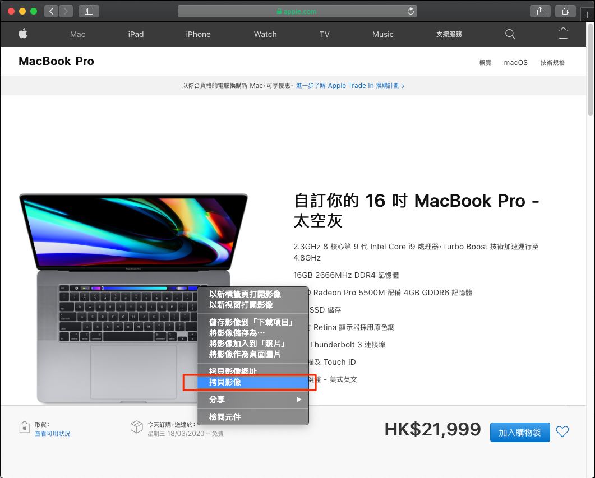
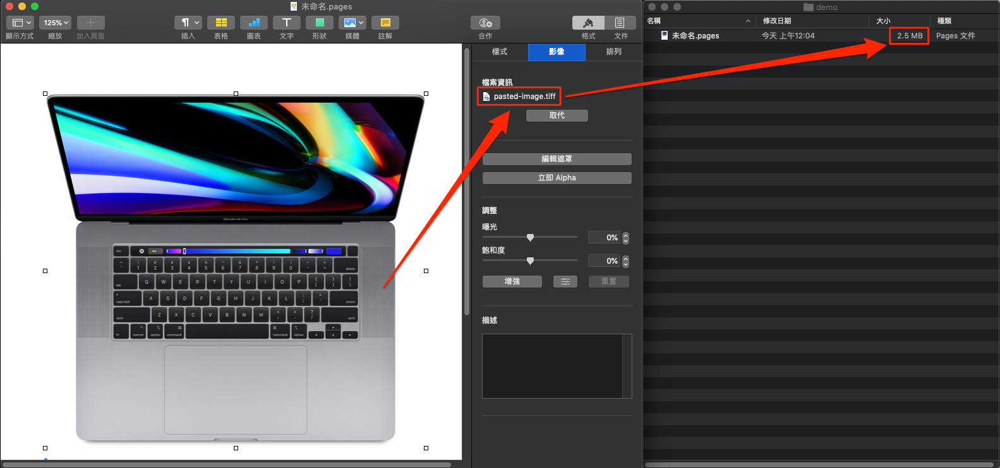
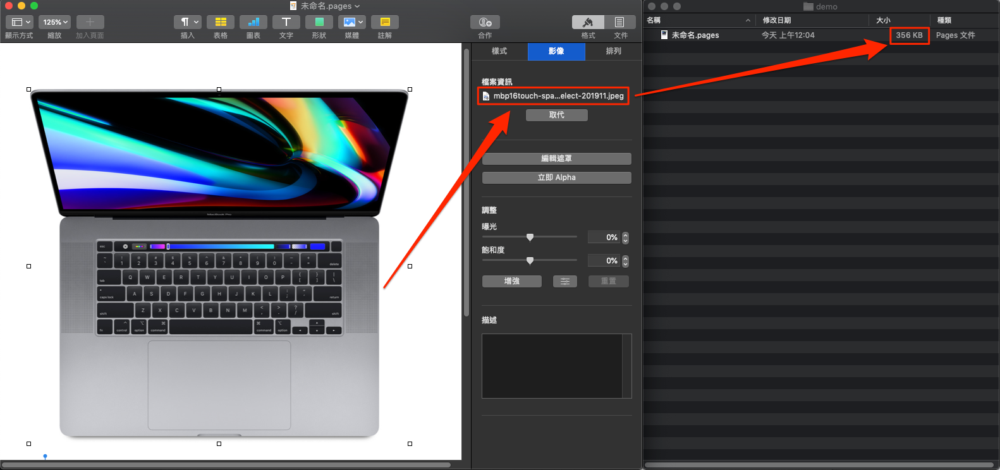
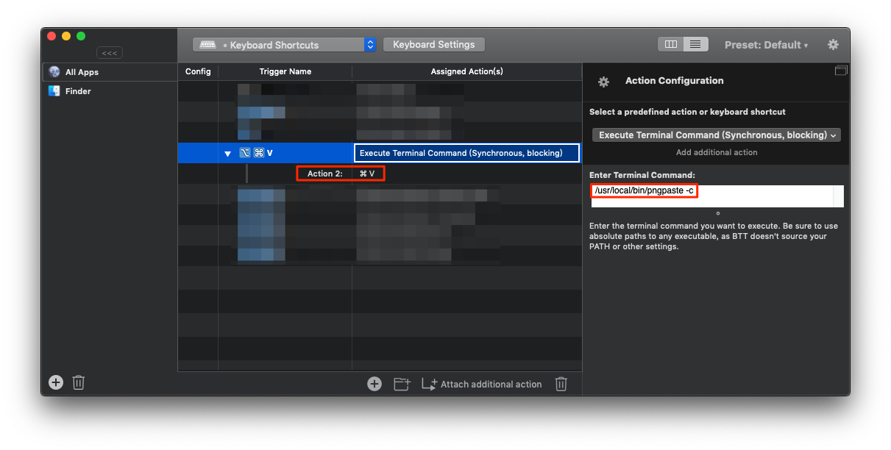

pngpaste
========

Paste PNG into files on MacOS, much like `pbpaste` does for text.

However instead of `pngpaste > thefile.png`, it's `pngpaste thefile.png`,
so one does not accidentally barf binary into the console.

原始功能請參考原專案：https://github.com/jcsalterego/pngpaste

此版本加入新功能：背景將剪貼板中圖片轉為 PNG 格式。由於為特殊需求並不符合原專案用途，故未 merge 回去。

### 動機

在 macOS 環境中複製圖片（非複製圖片檔案），在剪貼板中都會是 TIFF 格式。這會讓貼上後的檔案大小變大數倍，造成空間浪費。例如下面的例子：

1. 網頁看到圖片選右鍵「拷貝影像」
      
2. 將圖片貼到 Pages 空白頁發現圖片格式為 TIFF，儲存後 Pages 檔案約 2.5MB
      
3. 如果直接下載網頁中的圖，並拖拉到 Pages 空白頁儲存，檔案約 356KB，大小差了約 7 倍。
      

希望能背景將剪貼板中 TIFF 轉換成 PNG，貼上時直接就是 PNG 圖檔。

### 安裝

```
$ make all
$ make install
```

### 使用方法

```
pngpaste -c
```
執行上述指令會將剪貼板中的圖片背景轉成 PNG 格式，直接 `Command-V` 就可以貼上圖片

### 進階使用

搭配 [BetterTouchTool](https://folivora.ai/) 使用，設定一組快捷鍵會執行：

1. pngpaste -c
2. Command-V

例如：



往後複製圖片就可以直接按快捷鍵 `Option-Command-V` 貼上圖片了
